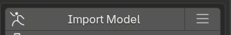
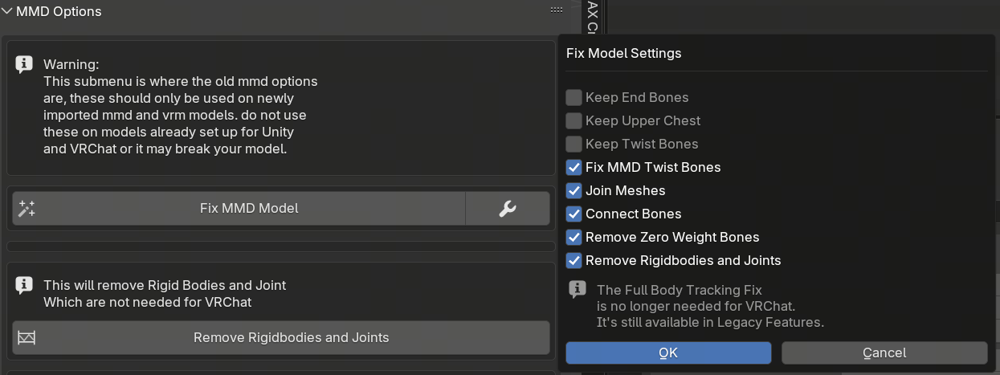
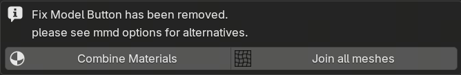
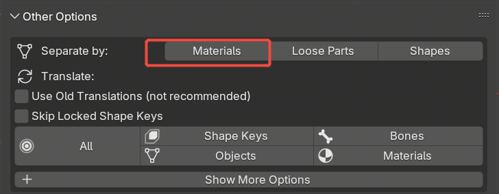

# Cats Blender Plugin for Blender 4.4

This is an unofficial version of the CATS Blender Plugin for Blender 4.4, specifically designed to process PMX models (MMD model format), convert them to GLB format, and export rigidbodies and joints physics information.

## Features

### Model Conversion
- **PMX to GLB Conversion**: Convert PMX model files to GLB format, suitable for modern 3D applications and game engines
- **Automatic Model Optimization**: Automatically performs bone fixing, mesh merging, material optimization, and other processing during import

### Model Processing Features
- Bone fixing and optimization
- Material merging and optimization
- Mesh separation and merging
- Bone naming normalization (replace spaces with underscores)
- Eye bone axis adjustment
- Root bone addition
- Material node reconstruction

## System Requirements

- **Blender Version**: 4.4.0 - 4.4.x (4.5 and above not supported)
- **Operating System**: Windows, macOS, Linux

## Installation

1. Download the plugin files
2. In Blender, open `Edit` > `Preferences` > `Add-ons`
3. Click the `Install...` button
4. Select the plugin folder or ZIP file
5. Enable the plugin

## Usage

### Basic Workflow

1. **Import PMX Model**
   - Use the plugin's import function to import PMX files
   
   
   
   - Use the plugin's Fix function

   
   
   - Merge materials

   

   - Separate mesh by materials

   

   - Modify bone names, replace spaces with underscores

   - Add root bone node

2. **Export to GLB**
   - Select the processed model in Blender
   - Use `File` > `Export` > `glTF 2.0` to export as GLB format

### Script Usage Example

The plugin provides an `all_fix.py` script that can batch process models via command line:

```python
# Modify the model path in all_fix.py
model_path = r'your_model_path.pmx'

# After running the script in Blender, it will automatically:
# 1. Import and optimize the model
# 2. Fix bone names
# 3. Adjust eye bones
# 4. Add root bone
# 5. Optimize materials
# 6. Export to GLB format
```

## License

MIT License

## Contributing

This is an unofficial version of the CATS Blender Plugin. If you have any questions or suggestions, please provide feedback via GitHub Issues.

## Related Links

- [Blender Official Website](https://www.blender.org/)
- [MMD Tools](https://github.com/powroupi/blender_mmd_tools)

---

# Cats Blender Plugin for Blender 4.4

这是一个用于 Blender 4.4 的 CATS Blender 插件非官方版本，专门用于处理 PMX 模型（MMD 模型格式），并将其转换为 GLB 格式，同时导出刚体（Rigidbodies）和关节（Joints）的物理信息。

## 功能特性

### 模型转换
- **PMX 到 GLB 转换**：将 PMX 模型文件转换为 GLB 格式，适用于现代 3D 应用和游戏引擎
- **自动模型优化**：导入时自动进行骨骼修复、网格合并、材质优化等处理

### 模型处理功能
- 骨骼修复和优化
- 材质合并和优化
- 网格分离和合并
- 骨骼命名规范化（空格替换为下划线）
- 眼部骨骼轴调整
- 根骨骼添加
- 材质节点重构

## 系统要求

- **Blender 版本**：4.4.0 - 4.4.x（不支持 4.5 及以上版本）
- **操作系统**：Windows、macOS、Linux

## 安装方法

1. 下载插件文件
2. 在 Blender 中打开 `编辑` > `偏好设置` > `插件`
3. 点击 `安装...` 按钮
4. 选择插件文件夹或 ZIP 文件
5. 启用插件

## 使用方法

### 基本工作流程

1. **导入 PMX 模型**
   - 使用插件的导入功能导入 PMX 文件
   
   
   
   - 使用插件的Fix 

   
   
   - 材质合并 

   

   - 按材质分割mesh 

   

   - 修改骨骼名称替换空格为下划线

   - 添加骨骼根节点

2. **导出为 GLB**
   - 在 Blender 中选择处理后的模型
   - 使用 `文件` > `导出` > `glTF 2.0` 导出为 GLB 格式

### 脚本使用示例

插件提供了 `all_fix.py` 脚本，可以通过命令行方式批量处理模型：

```python
# 修改 all_fix.py 中的模型路径
model_path = r'your_model_path.pmx'

# 在blender中运行脚本后会自动：
# 1. 导入并优化模型
# 2. 修复骨骼名称
# 3. 调整眼部骨骼
# 4. 添加根骨骼
# 5. 优化材质
# 6. 导出为 GLB 格式
```

## 许可证

MIT License

## 贡献

这是一个非官方版本的 CATS Blender 插件。如有问题或建议，请通过 GitHub Issues 反馈。

## 相关链接

- [Blender 官网](https://www.blender.org/)
- [MMD Tools](https://github.com/powroupi/blender_mmd_tools)
